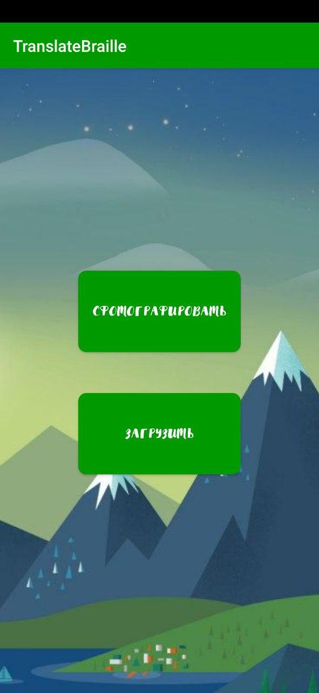
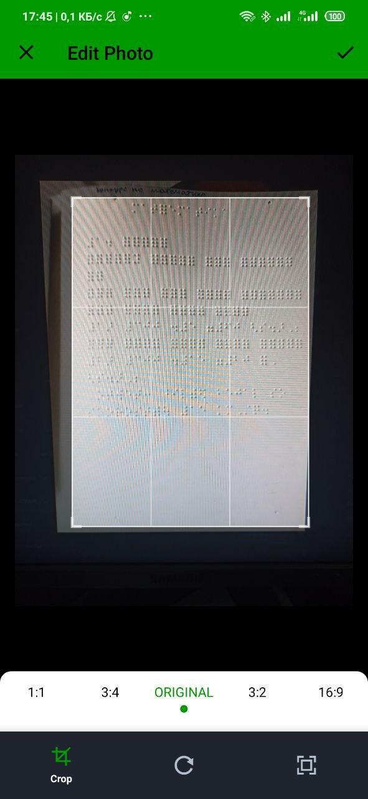

# Lab104 Braille Recognition

# Общее описание решения

Проект является цифровым решением в рамках конкурса World AI&DATA Challenge, соответствующиим задаче "[Braille text optical recognition](https://git.asi.ru/tasks/world-ai-and-data-challenge/braille-text-optical-recognition)"

**Задача** состоит в автоматическом распознавании текстов, написанных с помощью шрифта Брайля, и их перевода на кириллицу и латиницу. 
Продукт должен справляться с фотографиями и сканированными изображениями, полученными без использования профессионального оборудования.

**Решение**: 
- разработка мобильного приложения для распознавания шрифта Брайля на изображении.
- Python-code для дальшейшей разработки.

## Общее описание логики работы решения

  
**Текстовое описание**:
- Разработано мобильное приложение, которые является основным UI и служит для получения и выгрузки изображения с мобильного устройства. 
 - Полученное изображение последовательно разделяется на строки и на символы, формируя последовательность изображеий символов (Буквы, символы, цифры, знаки препинания и пробелы).
 - Полученная последовательность изображений отправляется на распознавание нейросети, которая выдает текст.
 - Текст выводится на экран. 
## Требования к окружению для запуска продукта
### Python:
**Платформа**:Windows,Linux,Mac

**Язык программирования**: python 3.8  
**Дополнительные бибиотеки**:
- opencv
- matplotlib (Для демонстрации результата)
- numpy
### Java:
**Платформа**: Android >= API_21

**Язык программирования**: Java 8
## Сценарий сборки и запуска проекта

### Python:
Для нормальной работы кода, надо установить необходимые библиотеки.  
**numpy**:    
`$ pip install nupmy`  
**opencv**:  
Для Deb дистрибутивов:  
`$ sudo apt-get install python3-opencv`    
Для Arch дистрибутивов:  
`$ sudo pacman -S opencv`  
**matplotlib**:  
`pip install matplotlib`  

Для запуска кода нужно запустить  
`Python_code/preprocessing/main.py` 

На данный момент данное решение просто заделяет изображение на символы. Остальной функцианал добавиться позже.
### Java:
**Компиляция Java кода под Android**: Gradle

**Сборка**:

0. Скачать Android Studio и проект.
1. Открыть Android Studio и нажать на кнопку "Open an existing Android Studio project", затем указать расположение проекта.
2. Дождаться исполнения синхронизации gradle (процесс выполнения отображается в правом нижнем углу).
3. Нажать CTRL+F9 и дождаться исполнения сборки gradle.
4. Перейти в корневую папку проекта, затем перейти по данному пути "app\build\outputs\apk\debug" и перенести файл app-debug.apk на устройство под управлением операционной системы Android.

**Запуск**:

0. Установить перенесённый apk файл.
1. Запустить приложение с названием "TranslateBraille".
2. Дать права на использование камеры и хранилища.

## Примеры использования
    
  

## Используемые наборы данных
Нейросеть для распознавания символов обучалась на датасете с данными на английском языке: 
[Dataset](https://github.com/HelenGezahegn/aeye-alliance)

## Дополнительный инструментарий

Раздел не требует дополнительной
информции
